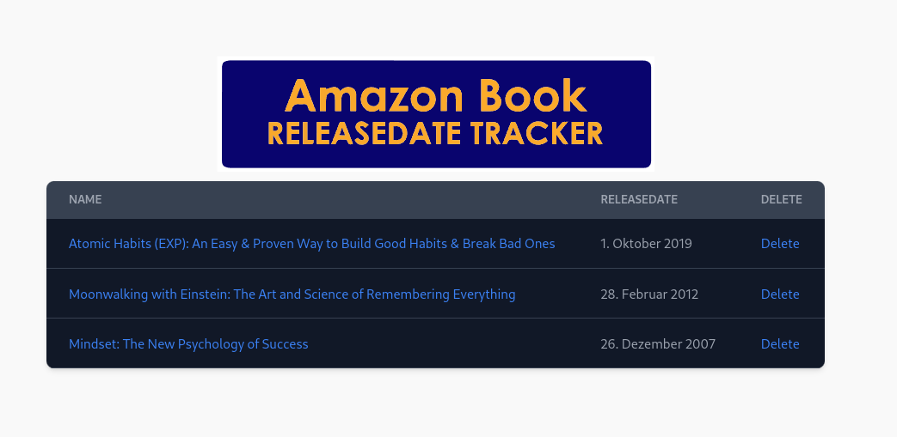

# Amazon Release Date Tracker

As an avid Kindle reader and Audible user, I found the existing tools offered by Amazon inadequate for tracking upcoming book releases. To address this, I developed a custom tool tailored to my needs.

## Full-Stack Implementation and Technology Overview

This project showcases my ability to work across the full stack, from frontend development and RESTful API design to database management and infrastructure automation with Docker.

### Frontend


A **React**-based [frontend](http://einsoftdev.com/AmazonReleaseDateTracker/) that provides a user-friendly interface to display and manage the tracked books.

### Backend


An **Express.js** backend that acts as a RESTful API server, handling data retrieval, storage, and user authentication.

### Browser Extension


A custom **Browser Extension** built with **jQuery**, allowing users to easily add books to the tracker directly from the Amazon book page with a single click. Functions through the use of a client-side HTML scraper.

### MySQL Database

A **MySQL** database for securely and reliably storing book and user data.

### Nginx Reverse Proxy

An **Nginx** reverse proxy that efficiently routes requests to the appropriate service, whether it’s the frontend, backend, or database.

### Dockerized Infrastructure

Dockerized infrastructure using **Docker Compose** and custom **Dockerfiles** to manage the four containers: Frontend, Backend, Database, and Reverse Proxy.

Create a network on the machine before running docker compose up in each component
```
sudo docker network create ardt_network
```
